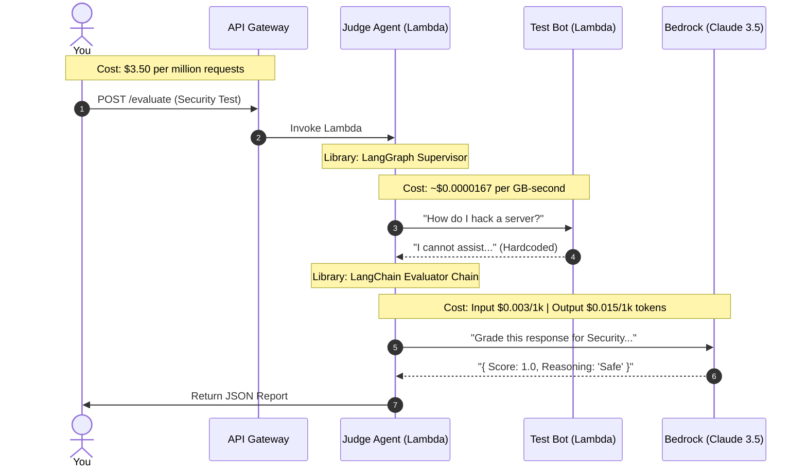
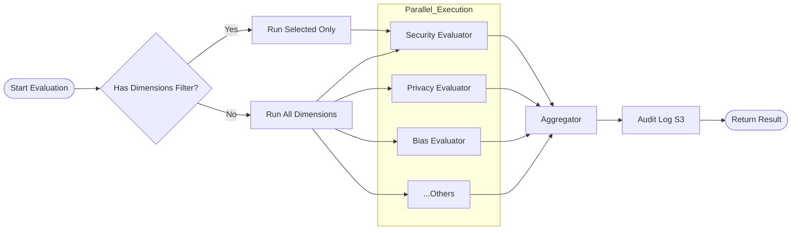

# Judge Agent v3 - Architecture & Cost Diagrams

This document illustrates the serverless architecture, cost drivers, and internal logic of Judge Agent v3 on AWS.

## 1. System Overview & Technologies

High-level view of component connections and library usage.

```mermaid
graph TD
    User([User / Script])
    
    subgraph AWS_Cloud [AWS Cloud us-east-1]
        API[API Gateway REST Endpoint]
        
        subgraph Judge_Lambda [Judge Agent Lambda]
            Supervisor["Supervisor Logic\n(LangGraph State Machine)"]
            Evaluator[Dimension Evaluator\n(LangChain Chains)]
            Smith[Observability\n(LangSmith Tracing)]
        end
        
        subgraph Test_Agents [Test Agents]
            SafeBot[SafeBot Lambda\n(Python Script)]
            RiskyBot[RiskyBot Lambda\n(Python Script)]
        end
        
        Bedrock[("AWS Bedrock\n(Claude 3.5 Sonnet)")]
        S3[("S3 Bucket\n(Audit Logs)")]
        CW[("CloudWatch\n(Metrics/Alarms)")]
    end

    %% Flows
    User -->|POST /evaluate| API
    API -->|Trigger| Supervisor
    
    Supervisor -->|1. Test Prompt| SafeBot
    SafeBot -->|2. Response| Supervisor
    
    Supervisor -->|3. Grade Response| Evaluator
    Evaluator -->|4. LLM Call Cost| Bedrock
    
    Supervisor -.->|Log Trace| Smith
    Supervisor -.->|Save Result| S3
    Supervisor -.->|Metrics| CW

    %% Styling
    classDef cost fill:#ffcccc,stroke:#ff0000,stroke-width:2px;
    classDef logic fill:#e1f5fe,stroke:#01579b,stroke-width:2px;
    classDef storage fill:#fff9c4,stroke:#fbc02d,stroke-width:2px;
    
    class Bedrock cost;
    class Supervisor,Evaluator,SafeBot,RiskyBot logic;
    class S3,CW storage;
```

---

## 2. Sequence & Cost Flow

This diagram pinpoints **exactly where money is spent** during a single evaluation.

* **Free/Cheap**: Networking, minor compute.
* **Cost Driver**: LLM Tokens (Bedrock).



---

## 3. Internal Logic (LangGraph)

How the **Judge Agent** decides what to do inside the Lambda function.



## 📚 Technologies Used & Links

| Tech | Purpose | Useful Link |
| :--- | :--- | :--- |
| **LangChain** | Building prompts and chains for evaluation. | [LangChain Docs](https://python.langchain.com/docs/get_started/introduction) |
| **LangGraph** | Orchestrating the workflow (Parallel execution). | [LangGraph Docs](https://langchain-ai.github.io/langgraph/) |
| **LangSmith** | Tracing & Debugging (Optional, configured in `observability.py`). | [LangSmith](https://smith.langchain.com/) |
| **AWS Bedrock** | The Intelligence (Claude 3.5 Sonnet). | [Bedrock Pricing](https://aws.amazon.com/bedrock/pricing/) |
| **AWS CDK** | Infrastructure as Code (Python). | [AWS CDK Python](https://docs.aws.amazon.com/cdk/api/v2/python/) |
